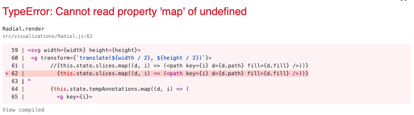

# Weather Visualization

Inspired by React Amsterdam 2018  

Getting a Linter warning. Had to uppercase the file names inside /src/visualizations so that they can be exported as React components.  

D3 accesses the DOM on transitions, axes and brushes.  
Combining the two to try to wrap a D3 viz with a UI.

# May 24
Trying to fix this error:
<<<<<<< HEAD

=======

>>>>>>> 87331707f037b29fbe13cf13b4bee20f64a166bb

## Available Scripts

### `npm start`
### `npm test`
### `npm run build`
### `npm run eject`
# weather-viz
